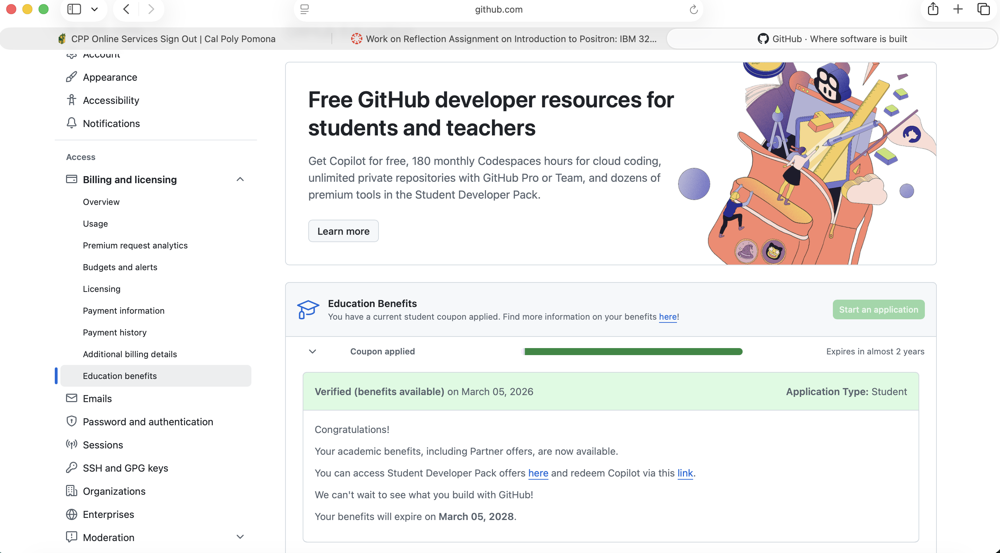

# Download and Install Positron

> Download and Install Positron. As you watch the videos in Step 1 and Step 3, follow the activities in the video and be familiar with Positron.

**Step 1:**

```{r}
x <- 123

```

**Step 3:**

```{r}
library(tidyverse)

set.seed(123)

df_scores <- tibble(
  student_id = 1:100,
  score = round(rnorm(100, mean = 75, sd = 10))
) |> 
  mutate(score = pmin(pmax(score, 0), 100))  # clamp to [0,100]

hist_plot <- ggplot(df_scores, aes(x = score)) +
  geom_histogram(binwidth = 5, color = "white", fill = "#2c7fb8") +
  labs(title = "Distribution of Student Test Scores", x = "Score", y = "Count") +
  theme_minimal()

hist_plot
df_scores

```

```{r}


library(dplyr)

df_scores |>
  filter(
    score > 75
  )
  
```

# What do you like about Positron

> Based on what you learned from Step 1 and Step 3, what do you like about Positron compared with RStudio?

Based on what I learned from Step 1 and Step 3, what I like about Positron compared with RStudio are many things. First off, in **step 1**, Susan gave a great introduction on what Positron offers. What I really liked was the built in data grid. This opens up a spreadsheet like view that allows us to sort and filter our data, really useful when dealing with large datasets. In **Step 3**, Isabella also shows that within the data grid, we can click on the arrow on the left side and will open a summary panel, that displays a scrolling list of all the column names and an icon representing their respective type. A spark line histogram or frequency table of the columns data is present next to the column. If we click on the carrot symbol for a column, it will expand to show additional summary statistics and a larger spark line. The positron assistant is an amazing tool that allows us to do things like ask it to summarize a data table, what do you see in the current plot, and based on the data tables in the session, give us suggestions, some starter code for interesting analysis. Overall, I like the fact that AI features, such as Positron Assistant, are built in to Positron. This allows for immediate problem solving, like fixing an error in our code, by simply asking what the issue is. The fact that its all you got to do is amazing. As someone who is new to coding, I was impressed by the capabilities of RStudio. Now with Positron, I am amazed at the vast amount of things that can be done, all in one place. I wont have to copy and paste my code and error message into ChatGPT anymore.

# In Step 4, the video demonstrates how you can use AI

## Describe the various ways you can use AI inside Positron. Some are free while others are not.

Some of the ways in which you can use AI inside Positron include:

-   **Positron Assistant:** designed for data science . In order to provide good suggestions, Positron Assistant uses your environment as context, so its suggestions work immediately with your data, plots, tables, and code.

-   **Inline Code Suggestions:** place cursor within your document at the location you want to add code, use Ctrl + I. This will open a small text box, allowing you to ask Positron Assistant questions, and will provide suggestions in line with the rest of your code.

-   **Databot:** available as an extension, an assistant for analyzing data. Designed to do exploratory data analysis very fast. You can analyze new data instantly with databot. I was impressed that you can combine multiple files and explore the data in seconds, as shown by Ryan Johnson in step 4.

## Which AI tools have you installed or set up? Which AI tools did you find beneficial for you?

The AI tools that I have installed and set up are GitHub Copilot and Databot. So far, I found GitHub Copilot beneficial to me as it enables Positron Assistant. I have encountered some errors in my code chunks that have prevented me from rendering my document. The ease with which Positron Assistant points to the issue and provides a solution is really amazing.

## I strongly recommend using GitHub Copilot, which is free if you apply for an education account.

### Apply for it and take a screenshot showing you were accepted into the education program.



### Play with it and do you find it helpful or distracting? Please e elaborate

I honestly find it very helpful. The Positron Assistant was impressive as it can do lots of things like:

-   **Help provided**: we can add context or simply ask a question to identify and fix the error.

-   **Summarize Data Sets:** great for large data sets.

-   **Generate example data frames:** such as the one Susan asked Positron Assistant to create in Step 1. "Generate an example data frame of student test scores and create a histogram of those scores".

-   **Inline Code Suggestions:** helpful to improve the plots created.

# Publish this report to GitHub Pages

> Publish this report to GitHub Pages and provide a URL to the GitHub Pages for the report. Note that although both GitHub Pages and GitHub repo are online, they are different. GitHub Pages is a website publishing service that hosts the rendered HTML from a QMD file.